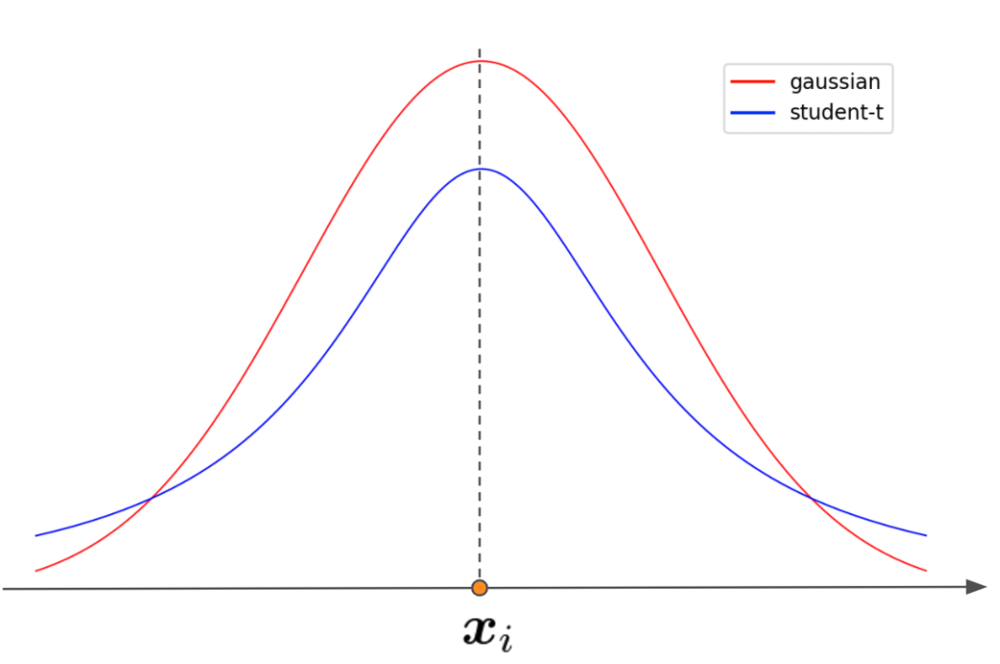

# t-SNE

t-SNEに関して勉強した内容をまとめる（[こちら](https://qiita.com/sakami/items/bb466161489771f7d2e9)に記載されているもののまとめ）

## t-SNEとは

student-t Stochastic Neighbor Embedding

スチューデントt分布に基づく確率的近傍埋め込み（？）

## SNE

SNEでは元の空間でのデータ間距離と圧縮後のデータ間距離が同じになるように圧縮する
（故にNeighbor Embedding）

圧縮前のデータを$x$, 圧縮後を$y$としてデータ間の距離を確率として以下で定義する

$$
p_{j|i} = \frac{\exp(- \| x_i - x_j \|^2 / 2 \sigma_i^2)}{\sum_{k \ne i}\exp(- \| x_i - x_k \|^2 / 2 \sigma_i^2)}
$$

$$
q_{j|i} = \frac{\exp(- \| y_i - y_j \|^2)}{\sum_{k \ne i}\exp(- \| y_i - y_k \|^2)}
$$

$\sigma_i^2$は密集しているデータと疎になっているデータのバランスを保つパラメータである

この2つの分布が近づくようにKL divergenceを最小化するよう$y$を決める

$$
C = \sum_i KL (P_i \| Q_i) = \sum_{i} \sum_{j} p_{j|i} \log \frac{p_{j|i}}{q_{j|i}}
$$

これをモーメンタム付き勾配降下法で最適化する

勾配降下法の際に勾配にノイズを与えて学習しており、このノイズの大きさに敏感であるという欠点がある

## t-SNE

t-SNEはSNEの改良版である

いくつかの改善があるが、代表的なものは圧縮後の確率分布として自由度1のstudent-t分布を採用したこと

$$
q_{ij} = \frac{(1 + \| y_i - y_j \|^2)^{-1}}{ \sum_{k, l \ne k} (1 + \| y_i - y_j \|^2)^{-1}}
$$

正規分布を利用する場合、以下の理由で学習が不安定になる
- データ間距離が大きい = 確率が低い時、正規分布だと極端に値が小さくなる
- 極端に値が小さい場合損失に大きな影響を与えるため、離れているデータを引き寄せる力が極端に強くなる
- データが中心に寄せ集められる**Crowding Problem**が発生し、これを最適化の中で上手いこと回避しないと可視化に失敗する

この欠点のポイントは分布の裾が重い点にあるため、これを回避するため分布の裾が軽い分布を利用する

極端に言えば遠くのデータを引き寄せる力を弱くすることによって安定化させている

## t-SNEの弱み

### 可視化以外で良い結果になっているか分からない

PCAやAuto Encoderと比べて圧縮の成否を測る指標がない

また、次元が増えると遠くのデータが増える = 遠くのデータの引き付けが弱くなることで影響が出るためstudent-t分布の自由度を調整する必要がある

### 次元の呪いに弱い

ユークリッド距離に基づく手法であるため高次元になると上手く機能しない

### 大域的最適解への収束が保証されない

実施する度に結果が変わりうる（random_stateを固定しなくてはならない）